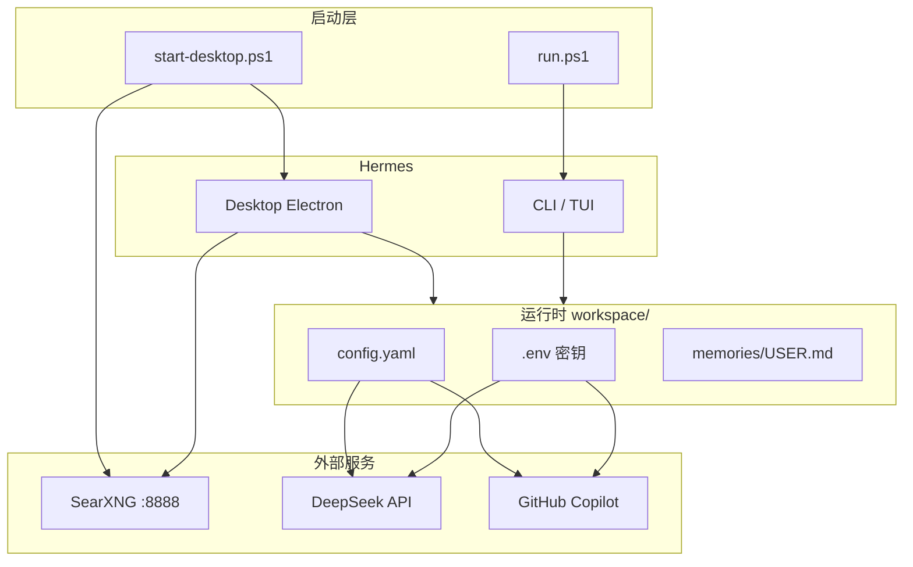

# JFM_HermesAgent_v0.1.0

> 基于 [Hermes Agent](https://github.com/NousResearch/hermes-agent) **v0.18.2** 的 Windows 便携部署版本。  
> 源码 + `workspace/` 数据同树存放，复制目录即可复现环境。

<p align="center">
  
</p>
<p align="center"><sub>Hermes Desktop — 模型与 Provider 配置（示例截图）</sub></p>

---

## 特性概览

| 模块 | 说明 |
|------|------|
| **CLI** | `run.ps1` 一键启动，数据写入 `workspace/` |
| **桌面版** | `start-desktop.ps1` 自动拉起 SearXNG + Electron 桌面 |
| **LLM** | DeepSeek V4 Pro（主对话） |
| **视觉** | GitHub Copilot GPT-5.4（`auxiliary.vision` 辅助看图） |
| **搜索** | 本机 SearXNG（Docker，`127.0.0.1:8888`） |
| **便携** | `HERMES_HOME=./workspace`，不污染 `%LOCALAPPDATA%` |

---

## 架构



---

## 快速开始

### 1. 环境要求

- Windows 10/11 + PowerShell
- Python 3.11–3.13（项目内 `.venv`）
- Node.js LTS（桌面版构建）
- Docker Desktop（SearXNG）
- Clash 等代理（可选，npm/Electron 下载用）

### 2. 配置密钥

```powershell
cd JFM_HermesAgent_v0.1.0   # 本地目录名可按需重命名
Copy-Item workspace\.env.example workspace\.env
# 编辑 workspace\.env，填入 DEEPSEEK_API_KEY 等（勿提交到 Git）
```

### 3. 启动

```powershell
# CLI 交互
.\run.ps1

# 桌面版（推荐）
.\start-desktop.ps1
```

首次桌面版构建需 `npm ci`，国内网络请确保代理可用（`start-desktop.ps1` 已预设 Clash 7890 与国内镜像）。

---

## 目录结构

```
JFM_HermesAgent_v0.1.0/
├── run.ps1                 # CLI 便携启动器
├── start-desktop.ps1       # 桌面版 + SearXNG 一键启动
├── workspace/              # HERMES_HOME（配置、记忆、会话）
│   ├── config.yaml         # 模型 / 搜索 / 视觉路由（无密钥）
│   ├── .env.example        # 密钥模板
│   └── memories/USER.md    # 用户偏好
├── doc/original-readme/    # 上游官方 README 归档
└── docs/images/            # README 用图
```

---

## 配置要点

**`workspace/config.yaml`（节选）**

```yaml
model:
  provider: deepseek
  default: deepseek-v4-pro
web:
  backend: searxng
  search_backend: searxng
auxiliary:
  vision:
    provider: copilot
    model: gpt-5.4
```

- DeepSeek 负责主对话；看图走 Copilot 辅助模型（需 `gh auth` / Copilot 可用）。
- SearXNG 独立部署在 `D:\searxng`（可在 `start-desktop.ps1` 用 `-SearxngDir` 修改）。

---

## 安全说明

以下内容**已被 `.gitignore` 排除，禁止提交**：

- `workspace/.env` — API Key
- `workspace/auth.json` — OAuth / 凭据池
- `workspace/sessions/`、`*.db` — 会话与隐私数据
- `workspace/logs/`、`cache/` — 运行时缓存

推送前请确认：`git status` 中不出现上述文件。

---

## 上游与许可

- 上游项目：[NousResearch/hermes-agent](https://github.com/NousResearch/hermes-agent)（MIT）
- 官方 README 归档：[doc/original-readme/](doc/original-readme/)
- 在线文档：<https://hermes-agent.nousresearch.com/docs/>

---

## 作者

**JFM** — 生产实习便携部署定制
