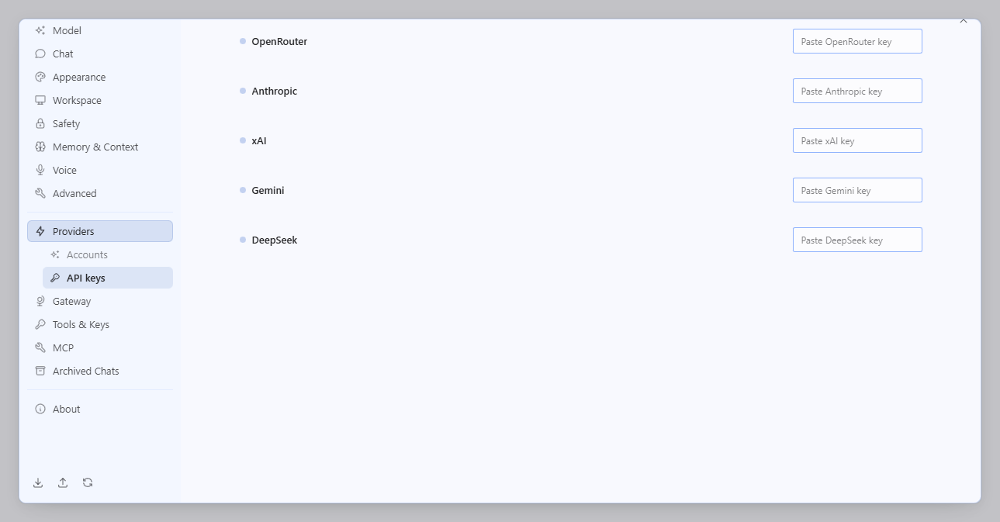
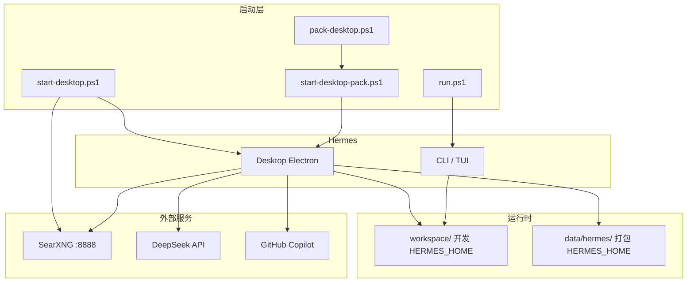

# JFM HermesAgent

[](https://github.com/JFM-2005/JFM_HermesAgent_v0.1.0/releases/tag/v0.1.2)
[](https://github.com/NousResearch/hermes-agent)

> **v0.1.2**（当前发行版，取代 v0.1.1）— 基于 [Hermes Agent](https://github.com/NousResearch/hermes-agent) **v0.18.2** 的 Windows 便携部署版本。  
> 源码 + `workspace/` 数据同树存放，复制目录即可复现环境；亦可打包为**单 exe 绿色版**分发。

<p align="center">
  
</p>
<p align="center"><sub>Hermes Desktop — 模型与 Provider 配置（示例截图）</sub></p>

---

## 特性概览

| 模块 | 说明 |
|------|------|
| **CLI** | `run.ps1` 一键启动，数据写入 `workspace/` |
| **桌面版（开发）** | `start-desktop.ps1` — SearXNG + `--source` 模式，**Hermes-dev.exe** 任务栏图标 |
| **桌面版（打包）** | `pack-desktop.ps1` → 单文件 `Hermes-Portable-*.exe`（与老师一致） |
| **LLM** | DeepSeek V4 Pro（主对话） |
| **视觉** | GitHub Copilot GPT-5.4（`auxiliary.vision` 辅助看图，需 Copilot 登录） |
| **搜索** | 本机 SearXNG（Docker，`127.0.0.1:8888`） |
| **便携** | 开发：`HERMES_HOME=./workspace`；打包：exe 旁 `data\hermes\` |
| **UI** | JFM 黑白主题（白底黑边）；自定义 `icon.ico` / 界面品牌图 |

---

## 架构



---

## 快速开始

### 1. 环境要求

- Windows 10/11 + PowerShell
- Python 3.11–3.13（项目内 `.venv`，`uv sync --locked`）
- Node.js LTS（桌面版构建，`npm ci`）
- Docker Desktop（SearXNG，可选）
- Clash 等代理（可选，npm/Electron 与 GitHub bootstrap 用）

### 2. 克隆与配置

```powershell
git clone https://github.com/JFM-2005/JFM_HermesAgent_v0.1.0.git
cd JFM_HermesAgent_v0.1.0
Copy-Item workspace\.env.example workspace\.env
# 编辑 workspace\.env：DEEPSEEK_API_KEY、GITHUB_TOKEN（Copilot 看图）等
```

默认分支 **`master`**；克隆后默认 `install.ps1` 使用 **`master`** 分支（非上游 `main`）。

### 3. 日常启动

```powershell
# CLI 交互
.\run.ps1

# 桌面版（开发 / 改源码）
.\start-desktop.ps1
```

开发模式会通过 `Hermes-dev.exe` + 开始菜单「Hermes Dev」快捷方式显示**自定义任务栏图标**（含中文路径项目目录）。若任务栏仍显示旧 Electron 图标，请取消固定后重新启动。

### 4. 打包 Windows 单文件绿色版（推荐分发）

只需分发 **一个 exe**，首次双击自动 bootstrap（Python 运行时 + 克隆本仓库）到 exe 旁的 `data\hermes\`：

```powershell
.\pack-desktop.ps1
```

产物：`apps\desktop\release\Hermes-Portable-<version>-<arch>.exe`

**使用方式**：把 exe 复制到任意目录，双击运行。首次启动需能访问 GitHub（建议 TUN/代理）；`install.ps1` 已内置于 exe，`raw.githubusercontent.com` 超时时仍可完成安装脚本阶段。

**数据目录**（与 exe 同目录自动创建）：

```
D:\你的文件夹\
├── Hermes-Portable-0.17.0-x64.exe
└── data\
    ├── hermes\          ← HERMES_HOME（配置、venv、克隆的仓库）
    └── Hermes\          ← Electron 用户数据
```

**启动已打包版本**：

```powershell
.\start-desktop-pack.ps1     # 优先启动 release 下的 portable exe
```

**手动打包**：

```powershell
npm ci
npm run desktop:package:portable:win
```

---

## 个性化

| 资源 | 路径 | 作用 |
|------|------|------|
| 任务栏 / exe 图标 | `apps/desktop/assets/icon.ico` | 打包 exe 与 `Hermes-dev.exe` |
| 界面内品牌图 | `apps/desktop/assets/icon.png` | 构建时同步到 `public/apple-touch-icon.png` |
| 黑白主题 | `apps/desktop/src/themes/presets.ts` | 默认 `nous` 皮肤：白底黑边、黑色主按钮 |

换图标后：开发模式重新 `.\start-desktop.ps1`（会自动 re-stamp）；打包需重新 `.\pack-desktop.ps1`。

---

## 目录结构

```
JFM_HermesAgent_v0.1.0/          # 仓库名保留 v0.1.0；发行版号见 VERSION / Releases
├── VERSION                      # 当前 0.1.2
├── CHANGELOG.md
├── run.ps1                      # CLI 便携启动器
├── start-desktop.ps1            # 开发桌面 + SearXNG
├── pack-desktop.ps1             # Windows 单 exe 打包
├── start-desktop-pack.ps1       # 启动 portable exe
├── workspace/                   # 开发时 HERMES_HOME
│   ├── config.yaml
│   ├── .env.example
│   └── memories/USER.md
├── apps/desktop/
│   ├── assets/icon.ico          # Windows 图标
│   └── scripts/launch-electron.mjs  # 开发启动 + 任务栏图标
├── doc/original-readme/         # 上游 README 归档
└── docs/images/                 # README 截图
```

---

## 版本管理

| 概念 | 说明 |
|------|------|
| **当前发行版** | **v0.1.2**（[`VERSION`](VERSION) / [Releases](https://github.com/JFM-2005/JFM_HermesAgent_v0.1.0/releases)） |
| **v0.1.1** | 已被 v0.1.2 取代（保留标签供对比，请使用 v0.1.2） |
| **上游版本** | Hermes Agent **v0.18.2** |
| **分支** | `master` 为主开发分支；发行打标签 `v0.1.x` |
| **变更日志** | [CHANGELOG.md](CHANGELOG.md) |

---

## 配置要点

**`workspace/config.yaml`（节选）**

```yaml
model:
  provider: deepseek
  default: deepseek-v4-pro
web:
  backend: searxng
  search_backend: searxng
auxiliary:
  vision:
    provider: copilot
    model: gpt-5.4
```

- DeepSeek 负责主对话；**看图**走 Copilot（`.env` 中 `GITHUB_TOKEN` + Copilot 订阅，`browser_vision` / `vision_analyze` 需要）。
- SearXNG 默认 `D:\searxng`（`start-desktop.ps1 -SearxngDir` 可改）。

---

## 安全说明

以下内容**已被 `.gitignore` 排除，禁止提交**：

- `workspace/.env` — API Key
- `workspace/auth.json` — OAuth / 凭据池
- `workspace/sessions/`、`*.db` — 会话与隐私数据
- `workspace/logs/`、`cache/` — 运行时缓存

推送前请确认：`git status` 中不出现上述文件。

---

## 上游与许可

- 上游项目：[NousResearch/hermes-agent](https://github.com/NousResearch/hermes-agent)（MIT）
- 官方 README 归档：[doc/original-readme/](doc/original-readme/)
- 在线文档：<https://hermes-agent.nousresearch.com/docs/>

---

## 作者

**JFM** — 生产实习便携部署定制
