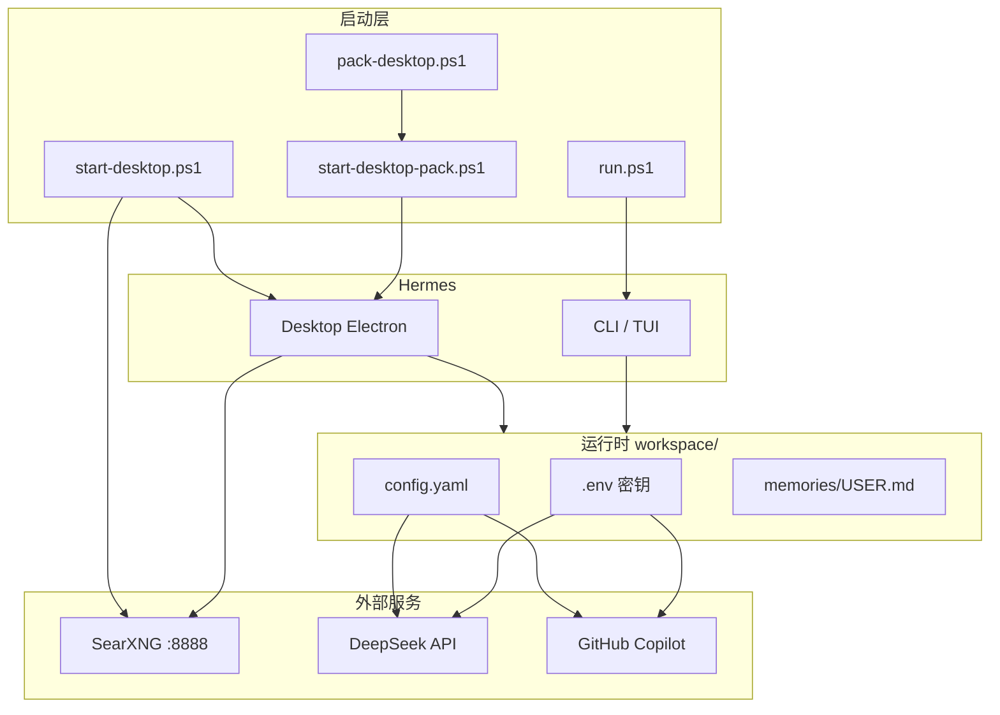

# JFM HermesAgent

[](https://github.com/JFM-2005/JFM_HermesAgent_v0.1.0/releases)
[](https://github.com/NousResearch/hermes-agent)

> **v0.1.1** — 基于 [Hermes Agent](https://github.com/NousResearch/hermes-agent) **v0.18.2** 的 Windows 便携部署版本。  
> 源码 + `workspace/` 数据同树存放，复制目录即可复现环境。

<p align="center">
  
</p>
<p align="center"><sub>Hermes Desktop — 模型与 Provider 配置（示例截图）</sub></p>

---

## 特性概览

| 模块 | 说明 |
|------|------|
| **CLI** | `run.ps1` 一键启动，数据写入 `workspace/` |
| **桌面版（开发）** | `start-desktop.ps1` — SearXNG + `--source` 模式 |
| **桌面版（打包）** | `pack-desktop.ps1` → `start-desktop-pack.ps1` 绿色便携版 |
| **LLM** | DeepSeek V4 Pro（主对话） |
| **视觉** | GitHub Copilot GPT-5.4（`auxiliary.vision` 辅助看图） |
| **搜索** | 本机 SearXNG（Docker，`127.0.0.1:8888`） |
| **便携** | `HERMES_HOME=./workspace`，不污染 `%LOCALAPPDATA%` |

---

## 架构



---

## 快速开始

### 1. 环境要求

- Windows 10/11 + PowerShell
- Python 3.11–3.13（项目内 `.venv`，`uv sync --locked`）
- Node.js LTS（桌面版构建，`npm ci`）
- Docker Desktop（SearXNG，可选）
- Clash 等代理（可选，npm/Electron 下载用）

### 2. 克隆与配置

```powershell
git clone https://github.com/JFM-2005/JFM_HermesAgent_v0.1.0.git
cd JFM_HermesAgent_v0.1.0
Copy-Item workspace\.env.example workspace\.env
# 编辑 workspace\.env，填入 DEEPSEEK_API_KEY 等（勿提交到 Git）
```

### 3. 日常启动

```powershell
# CLI 交互
.\run.ps1

# 桌面版（开发 / 改源码）
.\start-desktop.ps1
```

### 4. 打包 Windows 绿色便携版（v0.1.1+）

与老师实验流程等价，本项目提供一键脚本（含国内镜像、进程占用、图标预检）：

```powershell
.\pack-desktop.ps1
```

或手动：

```powershell
$env:ELECTRON_MIRROR = "https://npmmirror.com/mirrors/electron/"
$env:ELECTRON_BUILDER_BINARIES_MIRROR = "https://npmmirror.com/mirrors/electron-builder-binaries/"
npm ci
uv sync --locked
npm run desktop:package:portable:win
```

产物：`apps\desktop\release\win-unpacked\Hermes.exe`（需连同整个 `win-unpacked` 文件夹分发）

打包后启动：

```powershell
.\start-desktop-pack.ps1
```

---

## 目录结构

```
JFM_HermesAgent_v0.1.0/          # 仓库名保留 v0.1.0；项目版本见 VERSION / Releases
├── VERSION                      # 当前发行版号（0.1.1）
├── CHANGELOG.md                 # 版本变更记录
├── run.ps1                      # CLI 便携启动器
├── start-desktop.ps1            # 开发桌面 + SearXNG
├── pack-desktop.ps1             # Windows 绿色版打包
├── start-desktop-pack.ps1       # 打包版启动
├── workspace/                   # HERMES_HOME（配置、记忆、会话）
│   ├── config.yaml
│   ├── .env.example
│   └── memories/USER.md
├── doc/original-readme/         # 上游官方 README 归档
└── docs/images/                 # README 用图
```

---

## 版本管理

| 概念 | 说明 |
|------|------|
| **项目版本** | `VERSION` 文件与 [GitHub Releases](https://github.com/JFM-2005/JFM_HermesAgent_v0.1.0/releases) 标签 `v0.1.x` |
| **上游版本** | Hermes Agent **v0.18.2**（见 `doc/original-readme/`） |
| **分支** | `master` 为主开发分支；发行打标签 `v0.1.1`，不另开长期 release 分支 |
| **变更日志** | [CHANGELOG.md](CHANGELOG.md) |

---

## 配置要点

**`workspace/config.yaml`（节选）**

```yaml
model:
  provider: deepseek
  default: deepseek-v4-pro
web:
  backend: searxng
  search_backend: searxng
auxiliary:
  vision:
    provider: copilot
    model: gpt-5.4
```

- DeepSeek 负责主对话；看图走 Copilot 辅助模型（需 `gh auth` / Copilot 可用）。
- SearXNG 默认 `D:\searxng`（`start-desktop.ps1 -SearxngDir` 可改）。

---

## 安全说明

以下内容**已被 `.gitignore` 排除，禁止提交**：

- `workspace/.env` — API Key
- `workspace/auth.json` — OAuth / 凭据池
- `workspace/sessions/`、`*.db` — 会话与隐私数据
- `workspace/logs/`、`cache/` — 运行时缓存

推送前请确认：`git status` 中不出现上述文件。

---

## 上游与许可

- 上游项目：[NousResearch/hermes-agent](https://github.com/NousResearch/hermes-agent)（MIT）
- 官方 README 归档：[doc/original-readme/](doc/original-readme/)
- 在线文档：<https://hermes-agent.nousresearch.com/docs/>

---

## 作者

**JFM** — 生产实习便携部署定制
